I like going for walks, they break my day up, they get me out of my chair and they let me spend some time looking at trees, which are much nicer than walls and monitors.
Unfortunately I live in the UK and sometimes it rains, often, just when I want to go for a walk. This was an excellent excuse for an extremely over-engineered and time consuming project.

## Requirements and constraints

As a software developer I spend a lot of time at my desk, and it is my desk that I want to get away from when I go for a walk, so I wanted an easy way to see what the weather would be for the day from my desk.
It was also important that I didn't have to go digging for yet another window on my desktop to see the weather, I'd always get distracted by something and forget to check the weather until I wanted to go for a walk by which point it might be too late because the rain had started and was staying for hours.

The initial requirements for the project therefore became:

- A low powered, non-distracting display that could be mounted alongside my computer monitors
- Today's weather forecast updated frequently enough to be useful
- The time of today's sunset

## E-paper display

These requirements, and my interest in making things more interesting for myself, led naturally to an e-paper display.
Known primarily for their use in e-readers like the Kindle these displays only consume power when they are updating and are easily legible in any lighting conditions.
They are not however, the easiest devices to work with as they are fundamentally very different to a normal monitor.

And of course while thinking about this project the scope had expanded, if it was hooked up to my Home Assistant server it would make fetching the weather much easier, and I would be able to display other things about my flat.

Fortunately the company Waveshare have kindly solved both of these problems for me.

### Waveshare E-Paper ESP32 driver board

The core of this project is a Waveshare E-Paper ESP32 Driver Board, it handles the complexity of driving an e-paper display and, using ESPHome, it can be configured entirely with a single YAML file.

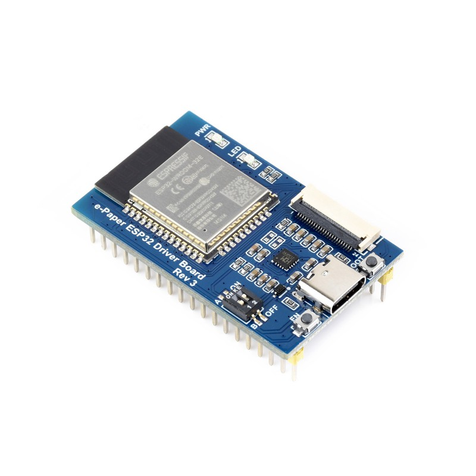

The e-paper display itself is a Waveshare 7.5" red, black and white E-Paper E-Ink display, it has a good balance of price to size and its ability to render red gave the entire project yet another use.

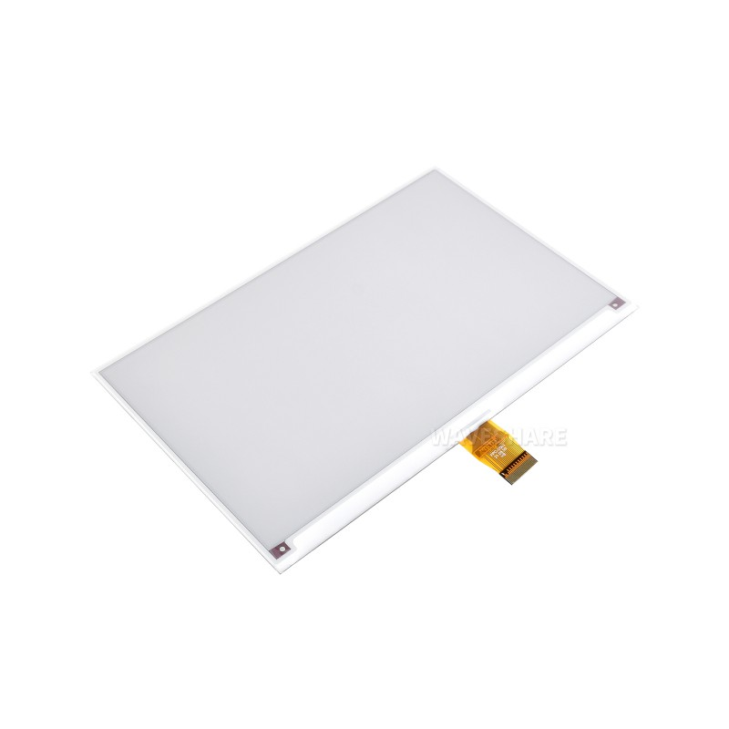

## Home Assistant alerts & events

My flat has leak sensors installed in the kitchen and bathrooms, these are already configured to send push notifications the moment a leak is detected.
But as any home owner knows leaks can be very damaging very quickly, so I wanted my status display to also alert me as soon as possible in case I was at my desk without my phone.

This is where the red colour of the e-paper display comes in, when an alert is triggered the display shows an alert instead:

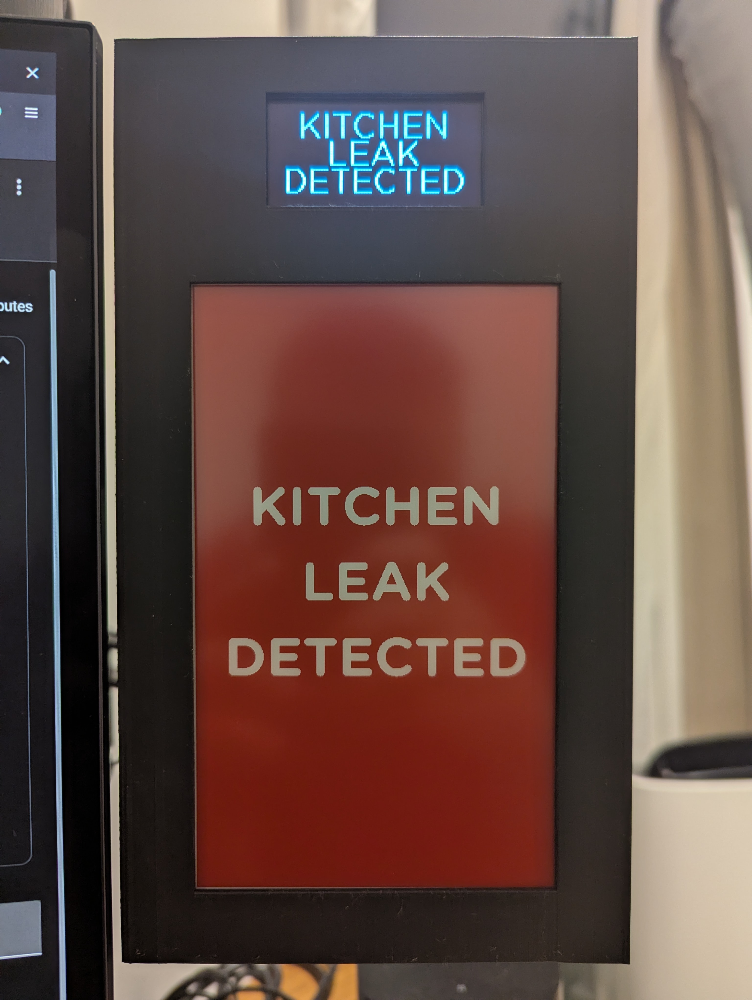

The observant among you will by now have noticed that there are two displays, the e-paper display I have spoken about already and another smaller display.
This is because an e-paper display is not suited to displaying real time events. It has a finite number of refreshes, and each refresh takes about fifteen seconds.

### I2C display

Unfortunately the SPI bus is entirely occupied by the e-paper on this driver board so larger TFT screens are incompatible.
But the I2C bus is completely free, and if you just want to be able to display short notification messages then its low bandwidth is not an issue.

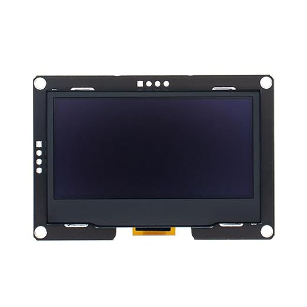

So I went looking for the nicest I2C display I could find and Amazon stocks the Hailege 2.42" SSD1309 128x64 OLED display.
The bright clear image is easy to read and the display is large enough to show three lines of text.

### Temperature, humidity and CO2 sensor

Given we have an ESP32 board, and there is space on the I2C bus for more than just the secondary display, I wondered what else would be useful.
I knew that CO2 concentration in the air affects your ability to mentally concentrate, so I went looking for a cheap CO2 sensor, and the SCD40 fit the bill perfectly.

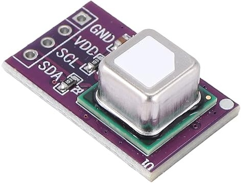

And to notify me when the CO2 levels are too high, we can use the OLED display.

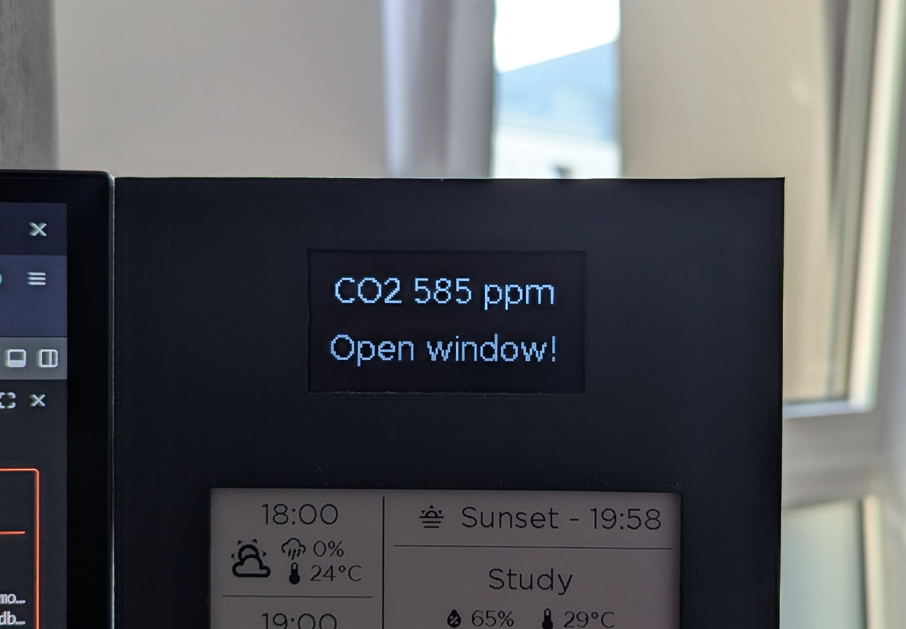

## 3D printed case

All of these components need a structure to hold them together and some way of mounting them.
Given I want this display to be mounted on my desk near my monitors, and my monitors are all on arms a VESA mount on the back was the logical choice.
What came next was the hardest piece of 3D modelling I have undertaken to date.

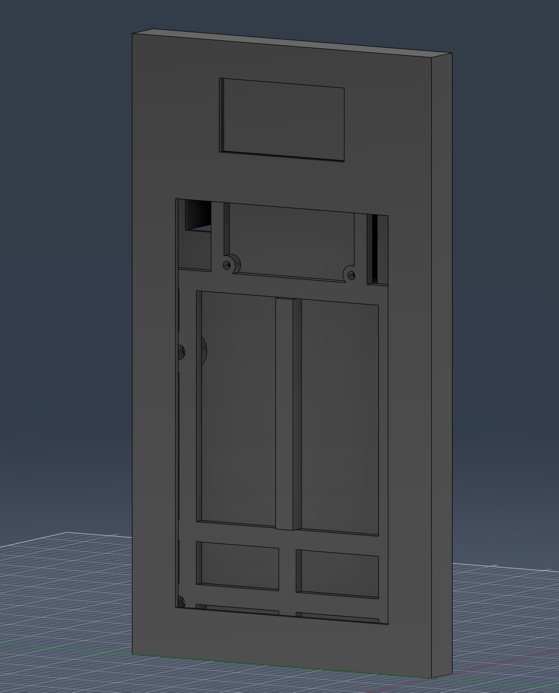

The core of the build is a chassis, this has eight M2 heat set threaded inserts to hold the OLED display and ESP32 carrier board.
It also has four M5 inserts for the VESA mount, the chassis is pictured below with the modelled OLED display (on the reverse) and ESP32 carrier and board.

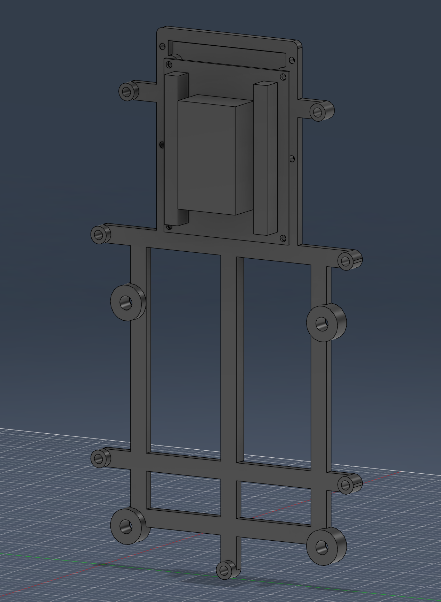

In front of that is the fascia, with cut outs for the OLED and e-paper displays, the e-paper display is held in place by being sandwiched between the chassis and fascia.
The fascia also contains seven M3 heat set threaded inserts that are used to secure the back, chassis and fascia together.

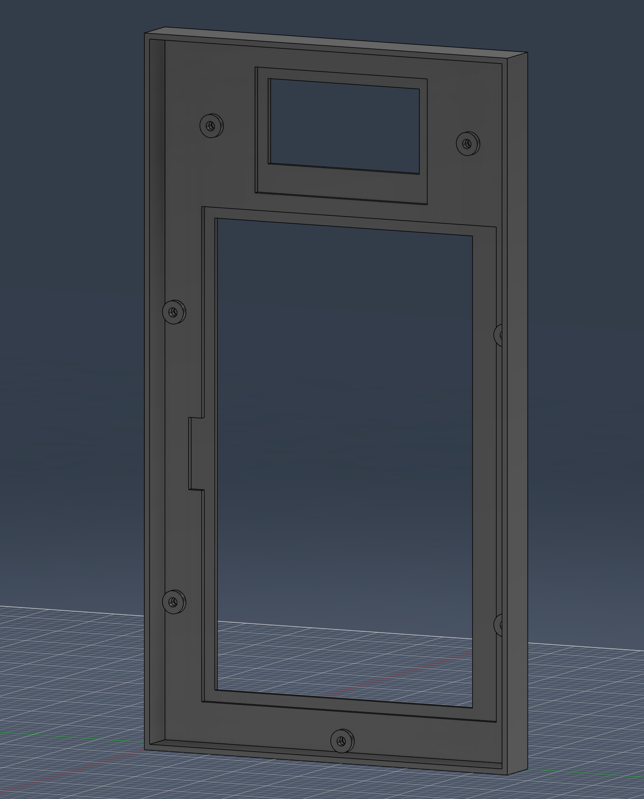

The final piece is the backing, it has screw holes and cut outs to allow for air flow to the SCD40 sensor and a power cable for the ESP32.

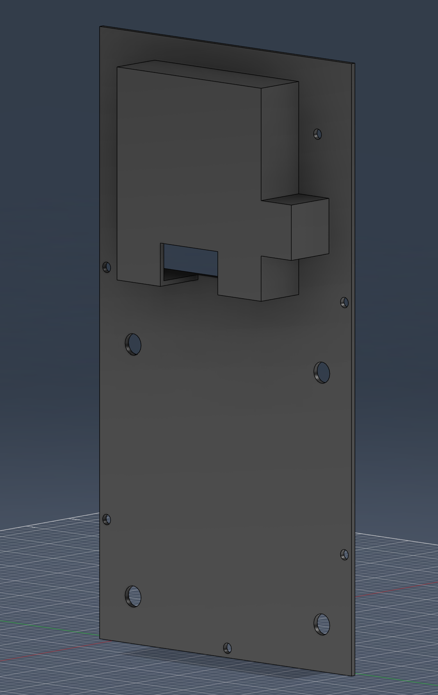

### Printing and assembly

The 3D models only just fit on the bed of my Ender 3 S1 Pro so I had to stand them on their side and run them diagonally across the bed. The fascia and the chassis have both printed reasonably well because they have enough thickness to be able to stand on their edge. The backing, however, is so thin that it has warped during printing. Fortunately it's good enough — I can't see it — and now I have an excuse to buy a better 3D printer.

Next I soldered the wires onto the OLED display and the SCD40. I chose solid core wire to help hold the SCD40 in place during assembly. This made assembly much easier because, unlike the OLED display and carrier board which are both screwed down, the SCD40 only sits in a slot in the backing — the solid core wire's own rigidity was enough to hold it up in place while I slotted it into the backing. Finally I installed the heat inserts in the chassis and fascia and screwed everything together.

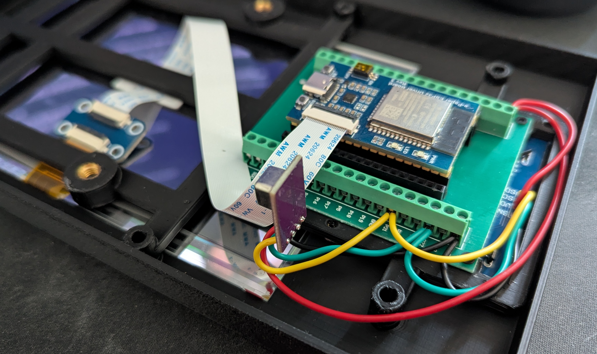

## YAML Configuration

This is an excellent point to talk about the inspiration for this project, the first blog I read was this post about building an [E-Paper Home Assistant dashboard](https://smarthomescene.com/diy/e-paper-dashboards-with-waveshare-and-esphome/).
This was an excellent introduction to the hardware, its limitations and how to begin configuring it. If you want a guide to the basics of wiring up a Waveshare e-paper display, defining colours and fonts, and pulling sensor values from Home Assistant, this post is a great place to start.

The next piece of inspiration was the also excellent [Weatherman dashboard project](https://github.com/Madelena/esphome-weatherman-dashboard/tree/main), this project's YAML configuration was used heavily as the basis of my own project, especially the weather specific pieces like the sunny, rainy, cloudy, etc icons.

Instead I'll focus on what is different about my project, specifically how to drive two different types of displays from a single ESP32 board, how I prolong the life of the e-paper display, how I ensured that all of the sensors were ready and had a value before the displays rendered, and a couple of tricks I used to keep the code more manageable.

### Two displays, one ESP32

The driver board's SPI bus is entirely occupied by the e-paper display, but as mentioned earlier the I2C bus was free, so the OLED display sits alongside it without any problems:

```yaml
spi:
  clk_pin: GPIO13
  mosi_pin: GPIO14

i2c:
  sda: GPIO21
  scl: GPIO22
```

ESPHome is happy to drive both from the same config, you just declare two entries under `display:`, one using the `waveshare_epaper` platform and one using `ssd1306_i2c`, each with its own `lambda` controlling what gets drawn:

```yaml
display:
  # OLED display
  - platform: ssd1306_i2c
    model: "SSD1306 128x64"
    address: 0x3C
    id: oled_display
    update_interval: 60s
    lambda: |-
      # ...covered in the sections below

  # e-paper display
  - platform: waveshare_epaper
    id: eink_display
    model: 7.50in-bV3-bwr
    rotation: 270°
    update_interval: never
    cs_pin:
      number: GPIO15
      ignore_strapping_warning: true
    dc_pin: GPIO27
    busy_pin:
      number: GPIO25
      inverted: true
    reset_pin: GPIO26
    lambda: |-
      # ...covered in the sections below
```

### Global alert system

Both displays need to react to the same set of alerts, the leak sensors and a failed Home Assistant backup, so rather than duplicating that logic in each display's lambda I compute it once into a global variable and have both displays read it:

```yaml
globals:
  - id: alert_active
    type: bool
    restore_value: no
    initial_value: "false"

script:
  - id: recompute_alerts
    then:
      - lambda: |-
          id(alert_active) =
            (id(alert_ha_backup_failure).has_state() && id(alert_ha_backup_failure).state) ||
            (id(ensuite_leak_sensor).has_state() && id(ensuite_leak_sensor).state) ||
            (id(kitchen_leak_sensor).has_state() && id(kitchen_leak_sensor).state);
```

The two displays then respond very differently to the same state. The e-paper updates the entire display with a large red alert:

```cpp
if (id(alert_active)) {
  it.fill(color_red);

  if (id(ensuite_leak_sensor).has_state() && id(ensuite_leak_sensor).state) {
    it.printf(240, 300, id(font_alert), color_white, TextAlign::CENTER, "ENSUITE");
    it.printf(240, 400, id(font_alert), color_white, TextAlign::CENTER, "LEAK");
    it.printf(240, 500, id(font_alert), color_white, TextAlign::CENTER, "DETECTED");
  }
  // ...remaining alert types follow the same pattern
}
```

Whereas the OLED just displays a small amount of text for as long as the alert is active:

```cpp
if (id(ensuite_leak_sensor).has_state() && id(ensuite_leak_sensor).state) {
  it.printf(64, 10, id(font_oled), TextAlign::TOP_CENTER, "ENSUITE LEAK");
  it.printf(64, 38, id(font_oled), TextAlign::TOP_CENTER, "DETECTED");
  return;
}
```

### Limiting e-paper refreshes

Because e-paper displays work by applying a voltage to tiny capsules and physically moving pigment inside those capsules, they wear out over time. Every time the display refreshes there is a chance that some of the particles of pigment get stuck, drift out of reach of the electrical field or clump together, if any of these happen then the affected capsules no longer display a crisp pixel.

Given the weather can be so changeable in the UK and how frequently the sensors in the flat update, refreshing the e-paper display every time something changes would degrade the display at a rapid rate for no gain. Moreover the display takes fifteen seconds to refresh, so it would spend more time flashing black and white than it would displaying useful information.

To combat this my computer is plugged into a smart plug that measures the current draw of the computer and the display only refreshes if my computer is turned on and in use (if the computer goes into idle it drops below the threshold as well). There is no point refreshing the display if I am not looking at it.

```yaml
time:
  - platform: homeassistant
    id: homeassistant_time
    on_time:
      - seconds: 0
        minutes: 15
        then:
          - if:
              condition:
                and:
                  - lambda: "return id(computer_on).has_state() && id(computer_on).state > 0.4;"
                  - lambda: "return id(alert_active) == false;"
              then:
                - script.execute: update_screen
```

The `computer_on` sensor reads the current draw of the smart plug my computer is plugged into. Alerts skip this throttling entirely, since a leak shouldn't have to wait fifteen minutes to show up.

The OLED display will also burn out from prolonged use, but this is combatted in two ways: first, it only displays an alert when something happens, which is infrequent; and second, it only shows alerts for one minute in every five.

### Waiting for sensors on boot

The first time the ESP32 boots, or reconnects after a power cut, none of the Home Assistant sensors it depends on have reported a value yet. Rendering immediately would mean showing a screen full of fallback states, so the boot sequence waits until everything it needs has actually reported in and has numeric value, or gives up after four minutes:

```yaml
esphome:
  name: displaystudyepaper
  on_boot:
    priority: -100
    then:
      - wait_until:
          condition:
            lambda: |-
              return
                id(pirateweather_apparent_temperature_0h).has_state() &&
                !std::isnan(id(pirateweather_apparent_temperature_0h).state) &&
                id(scd40_co2).has_state() &&
                # ...repeated for every sensor the display depends on
                id(homeassistant_time).now().is_valid();
          timeout: 240s
```

### Keeping the forecast rendering manageable

One of the e-paper display's main jobs is showing the current hour, and the next six hours of the weather forecast. Rather than hard coding the pixel position of every row, the layout is defined once as substitutions and the rendering lambda loops over it:

```yaml
substitutions:
  row_height: "113"
  start_y: "15"
```

```cpp
const int row_height = ${row_height};
const int start_y = ${start_y};

for (int i = 0; i < 7; i++) {
  int y_base = start_y + (i * row_height);

  it.printf(70, y_base, id(font_medium), color_black, TextAlign::TOP_CENTER,
            "%02d:00", hour_times[i].hour);

  // ...weather icon, precipitation and temperature for this row follow,
  // all positioned relative to y_base
}
```

Nudging the whole layout up, down, or further apart is then a one line change to `row_height` or `start_y`, rather than re-calculating seven sets of coordinates by hand.

## What's next

I will continue tweaking the e-paper display's layout to add more information to it as I add more sensors to my flat and think of other things I want to know about.

Physically I expect the display to remain largely untouched for a while, but at some point I would be interested in having a record of the air quality inside my flat beyond just CO2 concentration. To achieve this I am considering adding an SEN55 sensor. The SEN55 can measure PM1.0, PM2.5, PM4.0, PM10, VOC, NOx, temperature and humidity — combined with the SCD40's CO2, temperature and humidity readings, this would greatly expand the information I can view on my status display. However, the SEN55 is physically quite large and it has a small fan so it would require an extensive redesign of the chassis and backing plate. I have been playing about with Claude and the Autodesk Fusion MCP server, so hopefully this will be much easier than the initial design.

## Conclusion

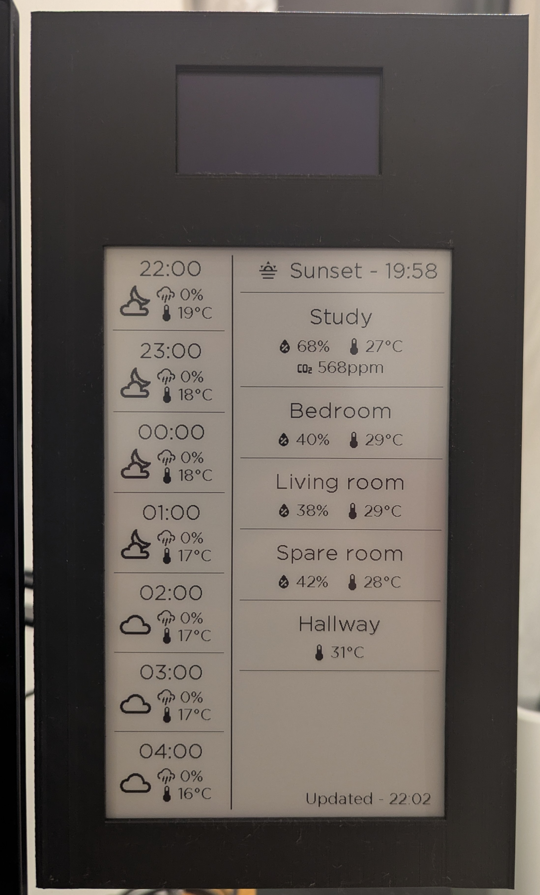

I am extremely happy with how this project has turned out. The printed parts only needed some sanding to fit together, the electronics all worked first time, and the display has been mounted on my desk and working for a couple of weeks now. Along the way I have learnt a lot about 3D modelling, how e-paper displays work, Home Assistant and ESPHome. More importantly, I have only scratched the surface of what all of these technologies can do and there is a lot still for me to learn.

All that is really left is for the current heat waves to finish and then the weather forecast will really start to earn its keep.
